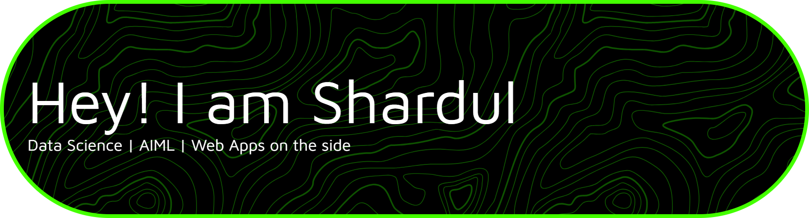

<!-- README.md -->

  

---

## 🌐 Connect with Me

  
  
  

---

## 🔍 About Me
- Computer Science undergraduate based in **Dehradun, India**
- Primarily focused on **Data Science, AIML, and applied Machine Learning**
- Experience building **end-to-end ML systems** — from data processing and model training to deployment
- Build **web applications on the side** to ship ideas, dashboards, and ML-backed products
- Interested in **real-world problem solving**, not just model accuracy

---

## 🧠 Current Focus Areas
- Machine Learning & Deep Learning (CNNs, NLP, multimodal systems)
- Data analysis, feature engineering, and model evaluation
- ML-backed backend systems (APIs, inference pipelines)
- Lightweight, clean web interfaces for ML products

---

## 🛠 Tech Stack

  

---

## 💬 Developer Philosophy

  <em>"Good systems are built at the intersection of data, logic, and usability."</em>

---

  ✨ Built with intent by <strong>Shardul Rana</strong>

